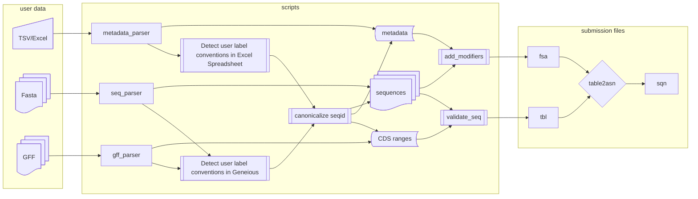

# Scripts for genbank submissions

The following code has custom scripts that convert sequence names to a Genbank-ready 
format in three different file types: GFF (exported from Geneious), FASTA (exported from Geneious), TSV/Excel (user's annotations).

The submitters are Tillie Dunham and Mollie Burton, whose sequences and annotation formats are similar but require individual attention.

